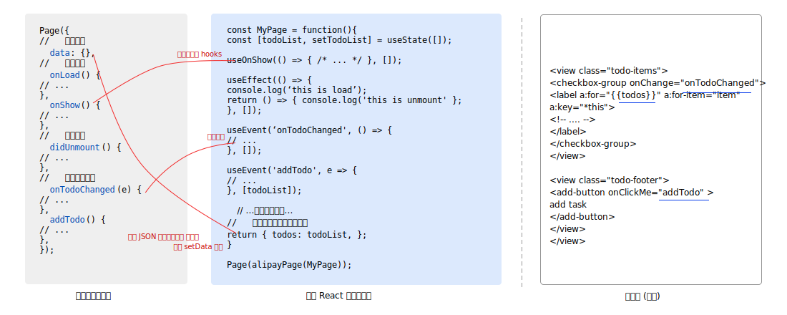

# functional-mini

使用 React 函数式组件开发小程序


 [](https://codecov.io/gh/ant-design/functional-mini) 

在前端开发生态中，React 函数式组件因其高效、简洁的特性，深受广大开发者喜爱。在使用 hooks 时，我们能轻松抽象和复用常见的业务逻辑。
然而，在尝试将这种模式引入 antd-mini 组件开发时，现有的开源方案让我们感到不便。这些方案虽然在编程体验上有优势，但复杂的预编译过程和反直觉的视图层更新模式增加了维护难度，并为 Bug 排查带来了困难。

因此，我们开发了 `functional-mini` 这个 SDK，旨在让开发者在小程序开发中更自然地使用 React 函数式组件。

`functional-mini` 的主要特性包括：

- 纯运行时 SDK，无需预编译，影响产物体积约 50 KB（gzip 后 22 KB）。
- 支持开发小程序页面和自定义组件。
- 使用 React 函数式组件编写逻辑，控制渲染数据。
- 通过 React hooks 实现小程序的生命周期接入，如 `useOnShow`、`useOnHide` 等。
- 组件的最后返回 JSON，SDK 会自动提交到视图层渲染。注意，组件中不能编写 JSX（具体原因可查阅[《详细说明》](./doc.md#为何无法使用-jsx)）。

项目库的 [`/example/todo-alipay`](./example/todo-alipay/) 和 [`/example/todo-wechat`](./example/todo-wechat/) 目录下分别提供了完整的支付宝和微信小程序演示项目供参考。


## 快速开始

我们以最简单的计数器页面为例。

### Step 1. 安装依赖

执行 `npm i functional-mini --save`。

### Step 2. 编写页面的逻辑

使用 Hooks 编写逻辑，然后利用 `alipayPage`、`wechatPage` 生成对应平台的 option 传递给 Page 函数。

```javascript
import {
  useState,
  useEvent,
  alipayPage,
  wechatPage,
} from 'functional-mini/page'; // 从 functional-mini/page 引入 hooks

// 编写页面逻辑
const Counter = ({ query }) => {
  // 通过 props 获取 query 参数
  const [count, setCount] = useState(0);
  // 绑定视图层的 add 事件
  useEvent('add', () => {
    setCount(count + 1);
  });

  // 将这些值提交到视图层
  return {
    count,
    isOdd: count % 2 === 1, // 使用`%`判断 count 是否为奇数
  };
};

// 生成配置，并返回给小程序框架的构造函数
Page(alipayPage(Counter)); // 支付宝小程序使用 alipayPage
// 或
Page(wechatPage(Counter)); // 微信小程序使用 wechatPage
```
### step 3. 视图层代码保持不变

视图层代码和各端原生规范一致，没有任何变化。这里是把 `{counter: number, isOdd: boolean}` 渲染到视图层，并绑定 `add` 事件的示意代码。

```html
<!-- 支付宝 -->
<button onTap="add">
  <text>{{count}}</text>
  <text>isOdd: {{isOdd}}</text>
</button>

<!-- 微信 -->
<button bind:tap="add">
  <text>{{count}}</text>
  <text>isOdd: {{isOdd}}</text>
</button>
```

至此，一个简单的计数器页面就实现完成了！

详细的使用文档可以看[这里](./doc.md)

## License

```
MIT License

Copyright (c) 2023 Ant Design Team

Permission is hereby granted, free of charge, to any person obtaining a copy
of this software and associated documentation files (the "Software"), to deal
in the Software without restriction, including without limitation the rights
to use, copy, modify, merge, publish, distribute, sublicense, and/or sell
copies of the Software, and to permit persons to whom the Software is
furnished to do so, subject to the following conditions:

The above copyright notice and this permission notice shall be included in all
copies or substantial portions of the Software.

THE SOFTWARE IS PROVIDED "AS IS", WITHOUT WARRANTY OF ANY KIND, EXPRESS OR
IMPLIED, INCLUDING BUT NOT LIMITED TO THE WARRANTIES OF MERCHANTABILITY,
FITNESS FOR A PARTICULAR PURPOSE AND NONINFRINGEMENT. IN NO EVENT SHALL THE
AUTHORS OR COPYRIGHT HOLDERS BE LIABLE FOR ANY CLAIM, DAMAGES OR OTHER
LIABILITY, WHETHER IN AN ACTION OF CONTRACT, TORT OR OTHERWISE, ARISING FROM,
OUT OF OR IN CONNECTION WITH THE SOFTWARE OR THE USE OR OTHER DEALINGS IN THE
SOFTWARE.
```
